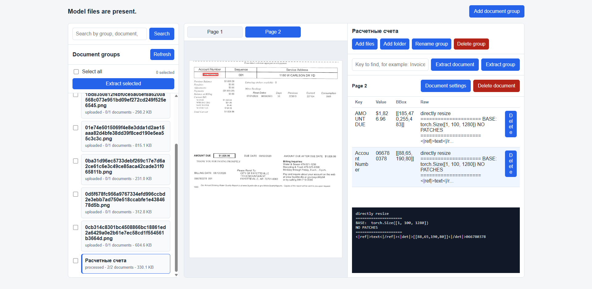

# «Использование LLM для извлечения пар "Ключ-значение" из электронных документов»

Веб-приложение для магистерской работы на тему: **«Использование LLM для извлечения пар "Ключ-значение" из электронных документов»**.

Система позволяет создавать группы документов, добавлять в них изображения или PDF-файлы, задавать интересующий ключ и получать от дообученной модели DeepSeek-OCR значение вместе с координатами найденной области.

## Основной сценарий

Модель обучалась на запрос по конкретному ключу.

Пользователь вводит ключ:

```text
Invoice Number
```

В модель отправляется prompt:

```text
<image>
Invoice Number
```

Ожидаемый ответ модели:

```text
<|ref|>text<|/ref|><|det|>[[x1,y1,x2,y2]]<|/det|>значение
```

Координаты bbox нормализованы в диапазон `0..999`.

## Возможности приложения

- создание групп документов;
- добавление в группу одного файла, нескольких файлов или папки с документами;
- загрузка изображений и PDF;
- автоматическое разбиение PDF на отдельные документы внутри группы;
- просмотр документов внутри выбранной группы;
- поиск по названию группы, названию документа, ключам и найденным значениям;
- ввод ключа для поиска значения;
- извлечение значения из одного документа внутри группы;
- извлечение значения по всей группе документов;
- извлечение значения по выбранным группам документов;
- сохранение результата: ключ, значение, bbox и raw output;
- подсветка bbox на изображении при клике по строке результата;
- переименование и удаление групп документов;
- изменение названия и порядкового номера документа внутри группы;
- удаление отдельных документов из группы;
- удаление результатов извлечения;
- оценка чекпоинта на подготовленном наборе KVP10k.

## Внешний вид приложения



## Структура проекта

- `app/` - FastAPI backend и статический frontend.
- `app/main.py` - API приложения.
- `app/db.py` - SQLite-схема и функции преобразования строк БД.
- `app/services/model.py` - загрузка DeepSeek-OCR и LoRA-чекпоинта.
- `app/services/parser.py` - парсинг ответа `<|ref|>...<|det|>...`.
- `checkpoint-1/` - LoRA-адаптер.
- `deepseek_ocr/` - базовая модель DeepSeek-OCR.
- `data/documents.sqlite3` - база данных.
- `data/uploads/` - временные загруженные файлы.
- `data/pages/` - изображения документов внутри групп.
- `scripts/evaluate_kvp10k.py` - оценка качества на KVP10k.
- `Dockerfile`, `docker-compose.yml` - запуск через Docker.

## Установка

```powershell
pip install -r requirements.txt
```

Базовая модель DeepSeek-OCR не хранится в репозитории, потому что занимает много места. После установки зависимостей ее нужно скачать отдельно:

```powershell
.\.venv\Scripts\python.exe scripts\download_model.py --target deepseek_ocr
```

LoRA-чекпоинт также не загружается в GitHub. Его нужно поместить в папку:

```text
checkpoint-1/
```

Если модель или адаптер лежат в другом месте, можно указать пути через переменные окружения:

```powershell
$env:DEEPSEEK_OCR_BASE_MODEL="D:\path\to\deepseek_ocr"
$env:DEEPSEEK_OCR_ADAPTER="D:\path\to\checkpoint-1"
```

Набор данных KVP10k также не хранится в репозитории. Для оценки скачайте его отдельно со страницы IBM Research на Hugging Face:

```text
https://huggingface.co/datasets/ibm-research/KVP10k
```

Для запуска скрипта оценки разложите тестовые файлы в структуру:

```text
test/gts/*.json
test/images/*.png
```

## Запуск локально

```powershell
.\.venv\Scripts\python.exe -m uvicorn app.main:app --host 127.0.0.1 --port 8000
```

Открыть в браузере:

```text
http://127.0.0.1:8000
```

## Как пользоваться

1. Нажать `Add document group` и ввести название группы.
2. Выбрать созданную группу в левом списке.
3. Нажать `Add files`, чтобы добавить один или несколько документов, либо `Add folder`, чтобы добавить папку с документами.
4. Переключить нужный документ внутри группы через вкладки с названиями файлов.
5. В поле `Key to find` ввести ключ.
6. Нажать `Extract document`, чтобы искать значение только в текущем документе.
7. Нажать `Extract group`, чтобы выполнить поиск по всем документам выбранной группы.
8. Для извлечения по нескольким группам отметить их чекбоксами слева и нажать `Extract selected`.
9. Кликнуть по строке результата, чтобы увидеть bbox на изображении.

## Оценка на KVP10k

Скрипт ожидает структуру:

```text
test/gts/*.json
test/images/*.png
```

Пример запуска на 1000 парах:

```powershell
.\.venv\Scripts\python.exe scripts\evaluate_kvp10k.py --gts test\gts --images test\images --limit 1000 --max-per-document 3 --output data\eval_kvp10k_limit100.jsonl --summary data\eval_kvp10k_limit100_summary.json
```

Интерпретация:

- `parse_success_rate` - доля ответов, которые удалось разобрать в формате значение + bbox;
- `value_exact_accuracy` - доля точных совпадений значения;
- `value_similarity_mean` - средняя текстовая похожесть предсказания и эталона;
- `bbox_iou_mean` - среднее пересечение bbox с эталонной областью;
- `bbox_iou_50_accuracy` - доля bbox с IoU не ниже 0.5.


## Docker

Приложение можно запустить через Docker Compose:

```powershell
docker compose up --build
```

После успешной сборки повторный запуск обычно быстрее:

```powershell
docker compose up -d
```

Остановить контейнер:

```powershell
docker compose down
```

Приложение будет доступно по адресу:

```text
http://127.0.0.1:8000
```

Проверка состояния контейнера:

```powershell
docker compose ps
docker compose logs --tail 80 kvp-app
```

Проверка доступности CUDA внутри контейнера:

```powershell
docker compose exec -T kvp-app python -c "import torch; print(torch.cuda.is_available(), torch.cuda.device_count())"
```

В `docker-compose.yml` добавлены `extra_hosts` для Debian, PyPI и PyTorch. Они нужны из-за проблемы Docker Desktop с DNS/IPv6: без них сборка может падать на `Temporary failure resolving`.
